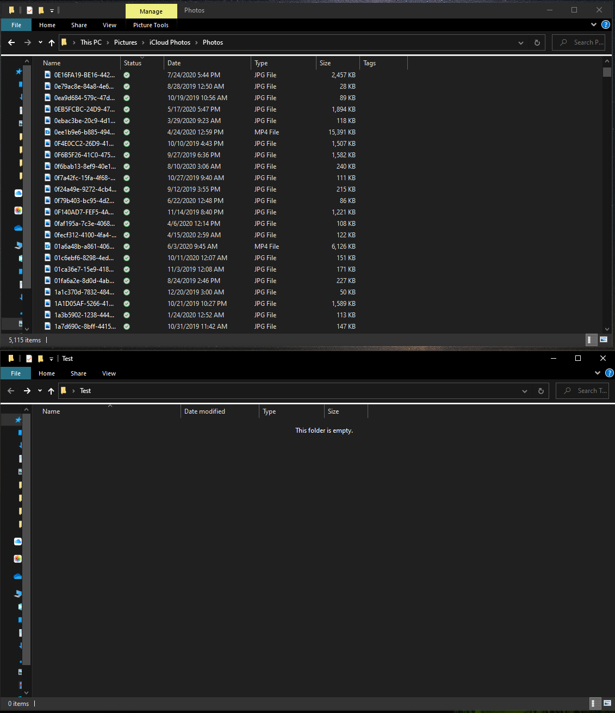
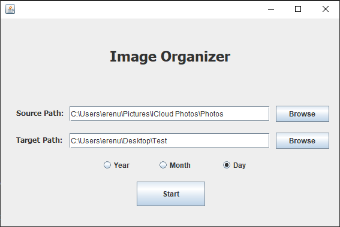
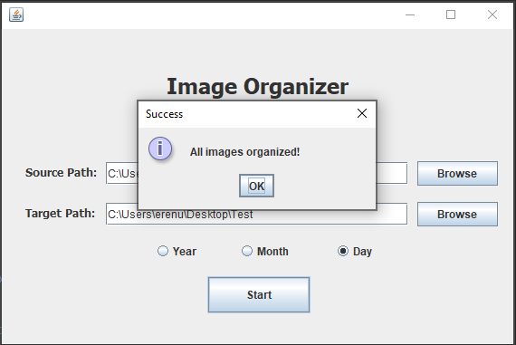
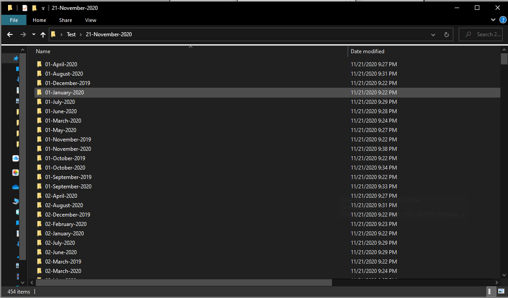

# Image-Organizer

I create this project for myself to organize my photos with ease. This program gets two paths first one is the source path, which is where photos locations, and the second one is the target path, which is where you want to copy your photos. In addition, this program allows you to decide on how you want to organize your photos like day, month, and year. While organizing photos, the program looks at the photos created date and creates a folder, and copies the photo to that folder. 

## Technologies

In this project, I used Java programming language and for the front-end I used Swing. In the project design, I used the <b>Composite Desing Pattern</b>. The Composite pattern is a partitioning design pattern and describes a group of objects that are treated the same way as a single instance of the same type of object. The intent of a composite is to “compose” objects into tree structures to represent part-whole hierarchies. It allows you to have a tree structure and ask each node in the tree structure to perform a task.

## Example Execution

In this example, I copied the photos from iCloud and copied photos to a specific folder.

Below is the main window of the program. For source path I give the path where my photos are located and for the target path I give the path that I want to copy my photos. In the example, I wanted to organize my photos by the day that they were taken so I pick Day as an organized type.

 

You can see the output of the program in the below image. First, it creates a folder named with the execution date, and it is 21-November-2020 for this example, put all the output to that folder. 

